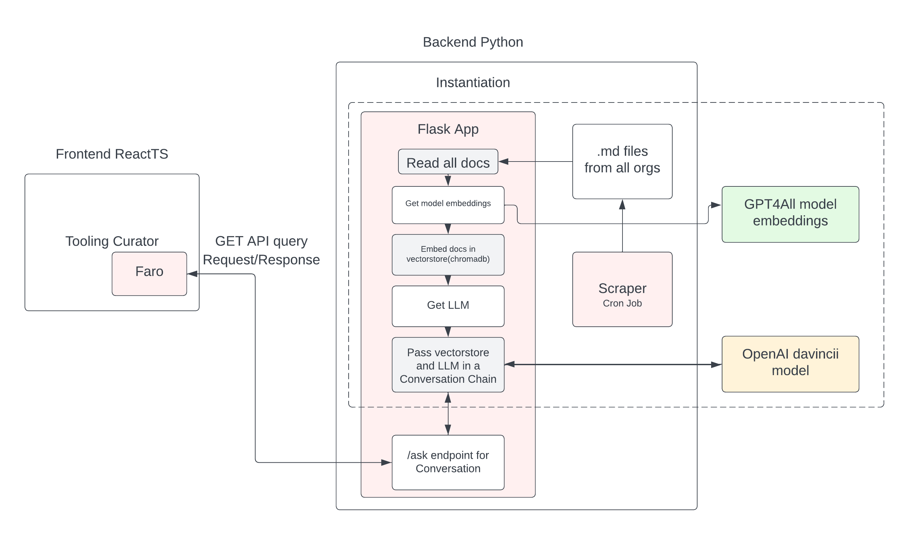

# faro

This repository is dedicated to the backend of the Faro, a chat-bot in the tooling curator. The main motivation to build this bot is to answer any queries across all organizations in Red Hat PerfScale.

The chat-bot is based on GPT, leveraging OpenAI's text-davincii-03 model as it's Large Language model along with the GPT4All Embedding function. It gives the opportunity to the user to ask specific queries regarding the tool which would be suitable for their specific use case. This is still in prototype stage, please contact the maintainers to submit any feedback or suggestions

The chatbot consists of the already persistant embedded documents which are read, similarity searched with the query and sent to the LLM. The LLM returns the answer which is forwarded to our custom built GET API. The endpoint which is exposed is /ask.

The following is the example of an API call.

/ask?query=what%20is%20elastic

The following are the parameters our API endpoint takes:

| Parameter | Type   | Default Value |
| --------- | ------ | ------------- |
| query     | string | ""            |

## Design



The code can either be run in a local machine or docker container.

### Local server

To run code locally, run

```
pip install venv
python3 -m venv venv
source venv/bin/activate
pip install -r requirements.txt
gunicorn wsgi:app
```

### Dockerfile

To use the Dockerfile, you'll be needing to add the certificate and key .pem files, which can be obtained from certbot. If not to run as a local docker container change the docker file command without the command line arguments of the key and certificate.

Create your own persistant db, with your own docs, by running the newdb.py as a standalone script

```
python3 newdb.py
```

This is still a prototype model of the backend.
